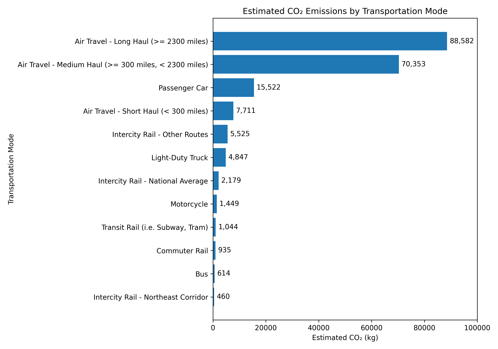
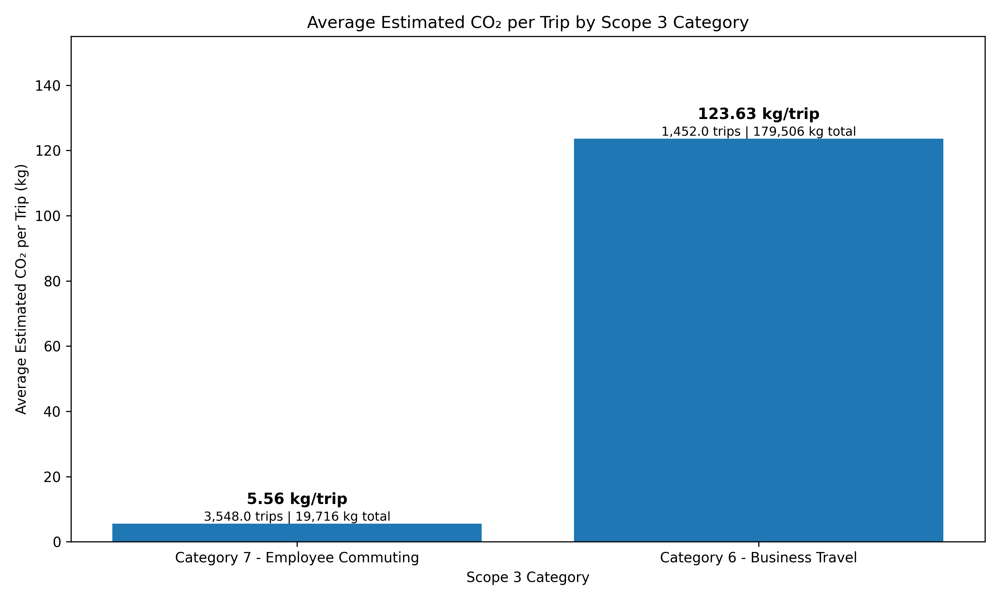
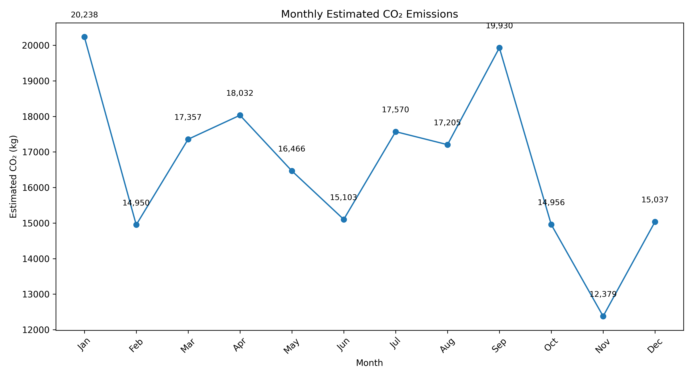
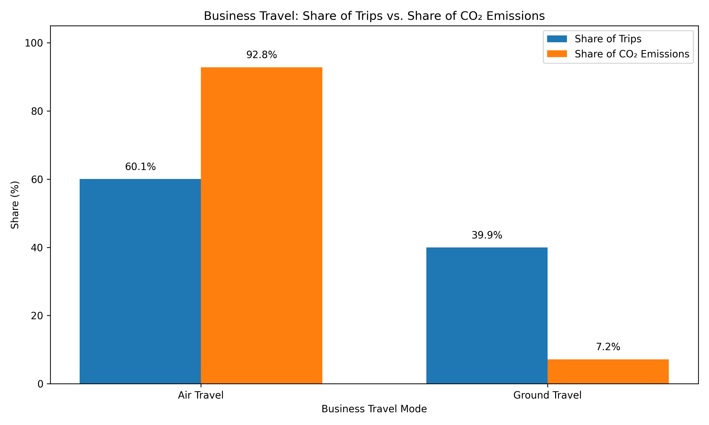

# Scope 3 Travel Emissions Analysis

## Project Overview

This project analyzes simulated employee travel activity to estimate greenhouse gas emissions associated with **GHG Protocol Scope 3 Category 6 (Business Travel)** and **Category 7 (Employee Commuting)**.

The project combines **PostgreSQL, SQL, Python, and EPA transportation emission factors** to demonstrate a reproducible workflow for transforming travel activity data into estimated CO₂ emissions and analytical insights.

The analysis includes data validation, emission-factor matching, emissions calculations, SQL-based analysis, KPI generation, and Python visualizations. The analysis examines emissions by transportation mode, Scope 3 category, month, and business-travel mode.

> **Note:** This project uses simulated travel activity and is intended as a portfolio demonstration of data analysis and sustainability-accounting concepts. It is not a formal corporate greenhouse gas inventory.

---

## Key Findings

* **5,000** simulated travel records analyzed
* **199,221.98 kg CO₂** in total estimated emissions
* **90.10%** of estimated emissions came from Business Travel
* Air travel represented **60.06% of Business Travel records** but accounted for **92.84% of Business Travel emissions**
* Average estimated emissions were **39.84 kg CO₂ per travel record**

### KPI Summary

A reproducible KPI summary is available in [`visualizations/kpi_summary.csv`](visualizations/kpi_summary.csv).

---

## Tools & Technologies

* **PostgreSQL / SQL** — data storage, transformation, validation, emissions calculations, and analysis
* **Python** — data generation, analysis, KPI creation, and visualization
* **pandas** — data manipulation and aggregation
* **Matplotlib** — data visualization
* **[U.S. EPA 2025 GHG Emission Factors Hub](https://www.epa.gov/climateleadership/ghg-emission-factors-hub)** — transportation emission factors
* **[GHG Protocol Corporate Value Chain (Scope 3) Standard](https://ghgprotocol.org/corporate-value-chain-scope-3-standard)** — emissions classification and accounting framework
* **Git / GitHub** — version control and project documentation

---

## Visualizations & Key Insights

### 1. Estimated CO₂ by Transportation Mode

Shows total estimated CO₂ emissions by transportation mode.



**Key insight:** Air travel is the largest contributor to estimated emissions in the simulated dataset, with long-haul and medium-haul air travel representing the two largest transportation-mode contributors.

---

### 2. Average CO₂ per Trip by Scope 3 Category

Shows average estimated CO₂ per travel record for Business Travel and Employee Commuting, with travel volume and total emissions providing additional context.



**Key insight:** Business Travel has substantially higher average estimated emissions per travel record than Employee Commuting and accounts for approximately 90% of total estimated emissions.

---

### 3. Monthly Estimated CO₂

Shows the monthly distribution of estimated CO₂ emissions throughout 2025.



**Key insight:** Monthly emissions vary throughout the year, providing visibility into changes in simulated travel activity and associated emissions.

---

### 4. Business Travel: Air vs. Ground

Compares the share of Business Travel records involving air travel with the share of Business Travel emissions attributable to air travel.



**Key insight:** Air travel represents approximately 60% of Business Travel records but approximately 93% of Business Travel emissions.

---

## Sustainability Framework & Methodology

### GHG Protocol Scope 3 Classification

The project uses the **GHG Protocol Corporate Value Chain (Scope 3) Standard** to classify employee travel activity.

The analysis focuses on:

* **Category 6 — Business Travel:** Employee transportation for business-related activities, including transportation such as air, rail, bus, and automobile travel.
* **Category 7 — Employee Commuting:** Employee transportation between home and the workplace.

The project applies a distance-based approach using transportation activity and corresponding emission factors.

### Emission Factors

Transportation emission factors were sourced from the **U.S. EPA 2025 GHG Emission Factors Hub**.

Factors were selected according to transportation mode and activity unit:

* **Vehicle-mile** for vehicle-based transportation
* **Passenger-mile** for passenger transportation such as air, rail, and bus travel

Estimated emissions are calculated by matching each travel record to the applicable transportation emission factor and multiplying the factor by the reported activity amount.

> **Source:** U.S. EPA 2025 GHG Emission Factors Hub, Table 10. Category 6/7 transportation factors represent combustion emissions only (tank-to-wheel) and do not represent upstream or well-to-wheel emissions.

---

## Analytical Workflow

The project follows a reproducible workflow combining PostgreSQL, SQL, and Python.

**Simulated Travel Activity → PostgreSQL → EPA Emission Factors → Validation → CO₂ Calculation → SQL Analysis → Python Visualization → Insights**

### 1. Data Generation & Preparation

A simulated travel activity dataset was generated to represent employee Business Travel and Employee Commuting activity during 2025.

The dataset contains **5,000 travel records** with fields including travel date, travel type, transportation mode, distance, activity unit, and origin/destination information.

### 2. Emission Factor Integration

Relevant EPA 2025 transportation emission factors were incorporated into the analysis.

Travel records were matched to emission factors using transportation mode and activity unit so that vehicle-mile activity was matched to vehicle-mile factors and passenger-mile activity was matched to passenger-mile factors.

### 3. Data Validation & Quality Assurance

Python and SQL validation checks were used to identify potential data-quality issues before analysis.

Checks included:

* Record counts
* Missing values
* Travel-type distributions
* Transportation-mode distributions
* Activity-unit consistency
* Emission-factor matching
* Calculated emissions completeness
* Vehicle-mile and passenger-mile classification

### 4. Emissions Calculation

Estimated CO₂ emissions were calculated by combining each travel record's activity data with its corresponding emission factor.

The resulting emissions estimates were used for downstream analysis and visualization.

### 5. SQL Analysis

SQL was used to aggregate and analyze estimated emissions across multiple dimensions, including:

* Scope 3 category
* Transportation mode
* Travel type
* Month
* Business Travel mode
* Origin state

Additional calculations examined emissions shares, average emissions per travel record, and the relationship between travel activity and estimated emissions.

The primary analysis queries are documented in:

`sql/emissions_analysis.sql`

### 6. Python Analysis & Visualization

Python and pandas were used to analyze the validated data and generate the project's visualizations and KPI summary.

The Python workflow produces:

* Transportation-mode emissions visualization
* Average CO₂ per trip by Scope 3 category
* Monthly emissions trend
* Business Travel air-versus-ground comparison
* KPI summary

---

## Data & Sources

### Travel Activity Data

The travel activity dataset is **simulated** for portfolio and analytical demonstration purposes.

It represents employee transportation activity during 2025 and includes transportation modes such as air travel, passenger vehicles, light-duty trucks, motorcycles, buses, and rail.

### EPA Emission Factors

The project uses transportation emission factors from the **[U.S. EPA 2025 GHG Emission Factors Hub](https://www.epa.gov/climateleadership/ghg-emission-factors-hub)**.

The original source file is retained in:

`data/raw/`

Processed emission-factor data used by the analysis is stored in:

`data/processed/`

### GHG Protocol

The **[GHG Protocol Corporate Value Chain (Scope 3) Standard](https://ghgprotocol.org/corporate-value-chain-scope-3-standard)** provides the framework used to classify Business Travel and Employee Commuting activity.

---

## Project Structure

```text
scope-3-travel-emissions/
│
├── data/
│   ├── raw/
│   │   └── ghg-emission-factors-hub-2025.xlsx
│   │
│   └── processed/
│       ├── category_6_7_emission_factors.csv
│       ├── travel_activity_sample.csv
│       └── travel_activity.csv
│
├── sql/
│   └── emissions_analysis.sql
│
├── python/
│   ├── create_visualizations.py
│   ├── generate_travel_data.py
│   ├── inspect_epa_data.py
│   ├── load_category_6_7.py
│   ├── load_travel_activity.py
│   └── validate_travel_data.py
│
├── visualizations/
│   ├── co2_by_transportation_mode.png
│   ├── avg_co2_per_trip.png
│   ├── monthly_co2.png
│   ├── business_air_vs_ground.png
│   └── kpi_summary.csv
│
├── README.md
└── .gitignore
```

### Directory Overview

| Directory / File  | Purpose                                                                                |
| ----------------- | -------------------------------------------------------------------------------------- |
| `data/raw/`       | Original EPA emission-factor source data                                               |
| `data/processed/` | Processed emission-factor and travel-activity datasets                                 |
| `sql/`            | SQL queries used for emissions analysis                                                |
| `python/`         | Python scripts for data generation, inspection, loading, validation, and visualization |
| `visualizations/` | Final charts and KPI output                                                            |
| `README.md`       | Project documentation                                                                  |
| `.gitignore`      | Files and local resources excluded from version control                                |

---

## How to Reproduce

### Prerequisites

The project requires:

* PostgreSQL
* Python 3.x
* pandas
* Matplotlib
* PostgreSQL client such as pgAdmin or `psql`

### 1. Clone the Repository

```bash
git clone <repository-url>
cd scope-3-travel-emissions
```

### 2. Set Up Python

Create and activate a virtual environment:

```bash
python3 -m venv .venv
source .venv/bin/activate
```

Install the required packages:

```bash
pip install pandas matplotlib psycopg2-binary
```

### 3. Set Up PostgreSQL

Create a PostgreSQL database for the project.

Database connection settings should be configured locally and should **not** be committed to the repository.

### 4. Generate Travel Data

Run the travel-data generation script:

```bash
python python/generate_travel_data.py
```

### 5. Load the Data

Load the relevant emission factors and travel activity into PostgreSQL:

```bash
python python/load_category_6_7.py
python python/load_travel_activity.py
```

### 6. Validate the Data

Run the validation script:

```bash
python python/validate_travel_data.py
```

### 7. Run the SQL Analysis

Open `sql/emissions_analysis.sql` in PostgreSQL and run the individual analysis queries against the `travel_activity` dataset.

### 8. Generate the Visualizations

Run:

```bash
python python/create_visualizations.py
```

The resulting charts and KPI summary are saved in:

```text
visualizations/
```

---

## Limitations

This project is designed as a portfolio analysis using simulated travel activity and publicly available emission factors. Several limitations should be considered when interpreting the results.

* **Simulated travel data:** The 5,000 travel records are simulated and do not represent actual employee travel or the emissions profile of a specific organization.
* **Combustion-only emission factors:** The EPA factors used for the relevant Category 6 and 7 transportation activities represent combustion emissions (tank-to-wheel) and do not capture upstream or well-to-wheel emissions.
* **Default emission factors:** The analysis uses publicly available EPA default factors rather than organization-specific or supplier-specific emissions data.
* **Scope of analysis:** The project focuses only on Scope 3 Categories 6 and 7 and does not represent a complete Scope 3 inventory.
* **Distance-based methodology:** Estimated emissions depend on reported travel distance and the applicable transportation emission factor. Actual emissions may vary based on factors such as vehicle efficiency, fuel type, occupancy, routing, and operating conditions.
* **No uncertainty assessment:** The project does not quantify uncertainty associated with the simulated activity data, emission factors, or resulting emissions estimates.
* **No formal reporting or assurance:** The analysis is intended to demonstrate data analysis and sustainability-accounting concepts and has not been prepared as a formal corporate greenhouse gas disclosure or independently assured inventory.

---

## Future Improvements

Potential extensions to the project include:

* Incorporating **organization-specific travel data** and supplier-provided emissions information where available.
* Expanding the analysis to additional **Scope 3 categories**.
* Incorporating **upstream or well-to-wheel emission factors** where appropriate.
* Adding **uncertainty analysis** to quantify potential ranges around estimated emissions.
* Developing an interactive dashboard to allow users to filter emissions by transportation mode, Scope 3 category, month, and other dimensions.
* Automating the data pipeline so updated travel activity can be processed and visualizations regenerated with minimal manual intervention.
* Adding additional sustainability metrics aligned with commonly used **ESG and sustainability reporting frameworks**.

